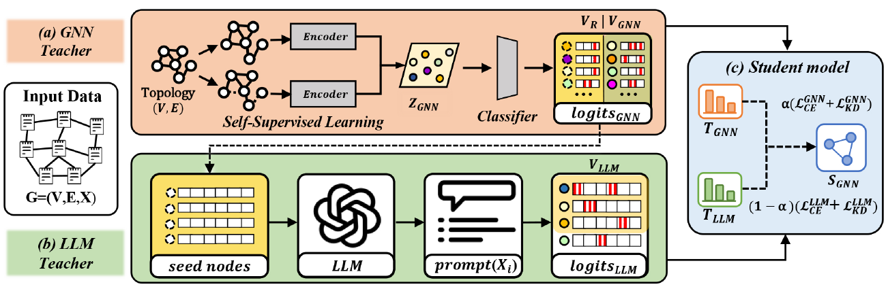

# CoTeach: Confidence-Aware Dual-Teacher Learning

This repository contains the implementation of **CoTeach**, a confidence-aware dual-teacher framework for few-shot node classification on text-attributed graphs.

CoTeach asks a simple question: **who should teach each node?** For nodes where graph structure is reliable, a GNN teacher provides supervision. For nodes where graph structure is uncertain, an LLM teacher provides semantic supervision from node text.



## Method Overview

CoTeach has three main components:

1. **GNN Teacher**
   - Learns structure-aware node representations with **Deep Graph Infomax (DGI)**.
   - Trains a two-layer MLP classifier on top of the learned embeddings.
   - Produces a pseudo-label, class probability distribution, and confidence score for each node.

2. **LLM Teacher**
   - Receives node text and candidate label names.
   - Predicts a class probability distribution in JSON format.
   - Keeps only predictions whose confidence exceeds the LLM confidence threshold.

3. **Student GNN**
   - Supports `GCN`, `GAT`, and `GraphSAGE` backbones.
   - Learns from both teachers using hard pseudo-label supervision and soft probability distillation.

The default execution follows the paper-style routing:

```text
GNN high-confidence nodes -> supervised by GNN Teacher
GNN low-confidence pool   -> queried by LLM Teacher
Reliable LLM predictions  -> used as fallback supervision
```

## Objective

The student is trained with teacher-specific cross-entropy and distribution distillation:

```text
L = alpha * (CE_GNN + KD_GNN) + (1 - alpha) * (CE_LLM + KD_LLM)
```

In this implementation, teacher confidence is also used as a sample weight, and teacher losses are scaled by the number of supervised nodes from each teacher.

## Repository Structure

```text
src/
  main_dual_teacher_ssl.py        # Main CLI entrypoint
  models/self_supervised_teacher.py

  gnn_teacher/
    dual_teacher_gnn_teacher.py  # GNN teacher wrapper
  llm_teacher/
    dual_teacher_llm.py          # LLM querying, parsing, and cache handling
  gnn_student/
    dual_teacher_student.py      # Student GNN
    losses.py                    # CE and distillation losses
  pipeline/
    dual_teacher_data.py         # Dataset loading and text/structure features
    dual_teacher_trainer.py      # Dual-teacher training loop

datasets/
  *.pt                           # Text-attributed graph datasets
  llm_cache/                     # Cached LLM responses

run_main_quick.sh                # Quick CoTeach run
```

## Supported Datasets

The main CLI supports:

```text
cora, citeseer, pubmed, wikics, arxiv
```

Dataset files are expected under `datasets/`:

```text
datasets/cora.pt
datasets/citeseer.pt
datasets/pubmed.pt
datasets/wikics.pt
```

Each dataset should contain graph structure, labels, and node text fields used by the loader.

## Environment

The provided environment is based on Python 3.10.

install the Python requirements directly:

```bash
pip install -r requirements.txt
```

For OpenAI-based LLM teacher calls, set an API key:

```bash
export OPENAI_API_KEY="your-api-key"
```

The code also checks `OPENAI_KEY` and `config.yaml`.

## Quick Run

From the repository root:

```bash
./run_main_quick.sh cora gcn 3 0.1 0.6 0.5 0.5
```

## Datasets
https://drive.google.com/drive/folders/1aWCshxG__Sj8hUBL1zcVeYDh0Gs--CpH?usp=drive_link

